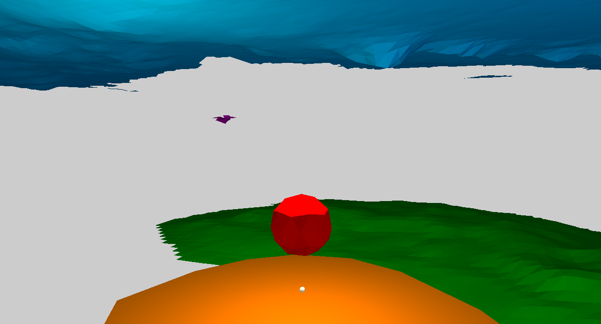
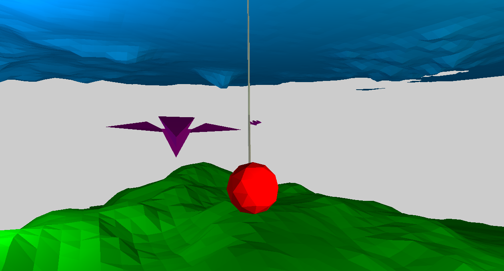

# LoPo
A 3D "game" written to get familiar with game physics concepts in less than a month.

# Building
You can find the precompiled binary for x64 architecture in releases. If you want to compile it yourself, use “build.bat”. Note that you should use x64 Native Tools Command Prompt or run Visual Studio’s “vcvarsall.bat x64” before building the project.

# Running
Use “run.bat” to start the game. Note that it may take few seconds to launch it since terrain meshes are slightly large in terms of vertex/triangle count. Also, do not forget to press B when the game is launched as it starts in pause mode.

# Controls
* Camera rotation: Hold right mouse button or shift key and drag the mouse
* Fire spring: Left mouse button
* Release spring: Middle mouse button
* Swing: Up/down arrow keys
* Pause/Resume: B

# Features
* Broad phase collision detection using AABB tests
* Narrow phase collision detection using GJK
* Uses BVH to accelerate collision detection
* Springs
* Two types of integrators (explicit and semi-implicit Euler)
* Ability to simulate forces (such as gravity)
* Uses a homebrew engine with OpenGL 3.2 as rendering backend

# Notes
* Ceiling and floor meshes are generated using Perlin textures
* [stb_image](https://github.com/nothings/stb/blob/master/stb_image.h) and [stb_image_write](https://github.com/nothings/stb/blob/master/stb_image_write.h) are used to read/write images. No other third-party library is used

# Known Issues
* Handling of asset management and scene management is pretty lousy.
* Loading takes too much time considering the (lack of) complexity of the game world. That is due to terrain meshes and BVH construction.
* Springs are instable due to constants and integrators used. Using RK4 would probably give more pleasant results.
* GJK does not produce contact data properly.
